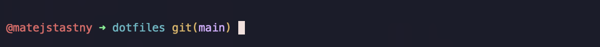
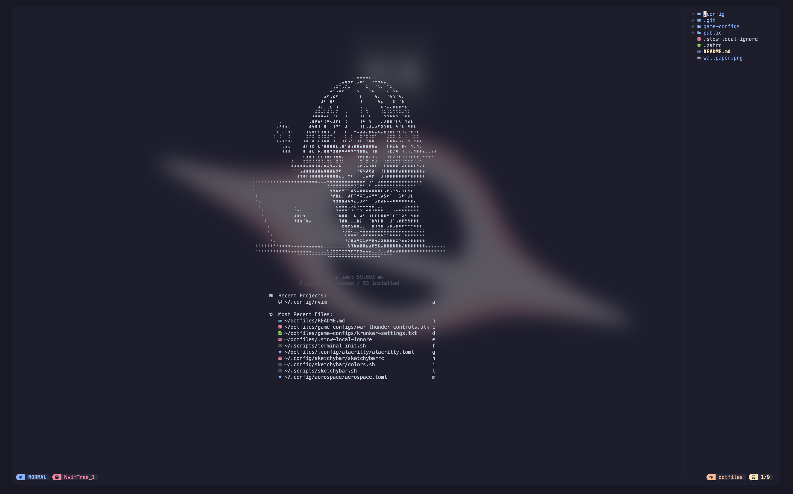
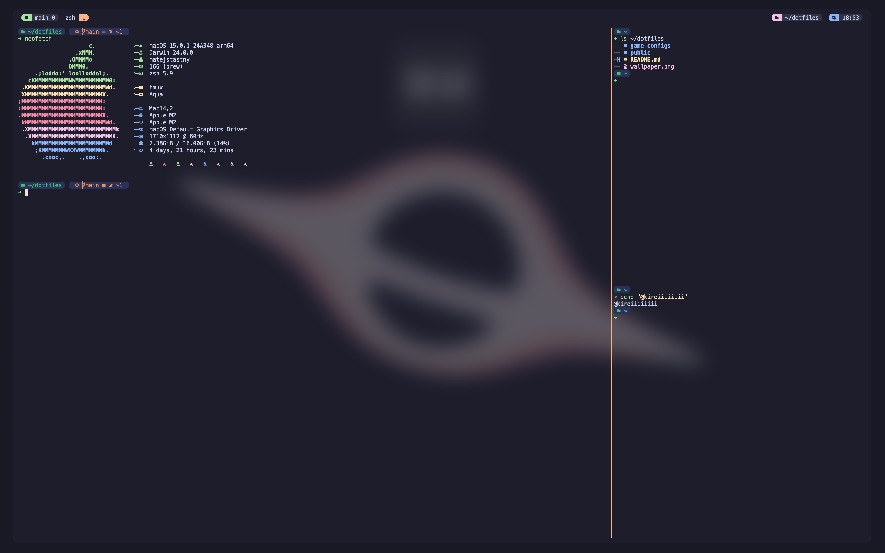

# dotfiles

My dofiles for apps I use for development on my MacOS laptop. [_GNU Stow_](https://www.gnu.org/software/stow/manual/stow.html) was used to create symlinks of the conf files. All of the files are configured to match the [Catppuccin](https://catppuccin.com/) _Mocha_ theme. My [wallpaper](./wallpaper.png) is also included.

## Requirements

### [Homebrew](https://brew.sh/)

```shell
/bin/bash -c "$(curl -fsSL https://raw.githubusercontent.com/Homebrew/install/HEAD/install.sh)"
```

### [Git](https://git-scm.com/)

```shell
brew install git
```

### [Stow](https://www.gnu.org/software/stow/manual/stow.html)

```shell
brew install stow
```

### [Nerd Fonts](https://www.nerdfonts.com/)

```shell
brew install font-meslo-lg-nerd-font
```

## Setup

Run the following command, to clone this dotfiles repo into your home directory. WARNING: The directory must be in `$HOME`

```shell
git clone https://github.com/kireiiiiiiii/dotfiles.git $HOME/dotfiles
```

Next step is to create the symlinks using stow. Run the following command to create symlinks from the directory you just cloned.

```shell
cd ~/dotfiles
stow .
```

---

## [oh-my-posh](https://ohmyposh.dev/)

This is the prompt theme engine I am using. There are a lot of themes downloaded from their website in this repo, that can be found under [`.poshthemes/`](./.poshthemes/) You can preview those themes on their [website](https://ohmyposh.dev/docs/themes). All new themes should be placed in the `.poshthemes` directory, because Stow will create a link to this directory in the `$HOME` directory. This link is then used in the `.zshrc`. I am currently using the [**Zash**](https://ohmyposh.dev/docs/themes#zash) theme (screenshot attached below, following screenshots of terminals might not be using this theme, because I switch between them fairly often). You can install _oh-my-posh_ by running:

```shell
brew install jandedobbeleer/oh-my-posh/oh-my-posh
```



## [Alacritty](https://github.com/alacritty/alacritty)

My primary terminal emulator. To install run:

```shell
brew install alacritty
```


## [Kitty](https://sw.kovidgoyal.net/kitty/)

My secondary terminal emulator. To install run:

```shell
curl -L https://sw.kovidgoyal.net/kitty/installer.sh | sh /dev/stdin
```


## [Neovim](https://neovim.io/)

My primary code editor. It's a heavily modified version of [NVChad](https://nvchad.com/) To install run:

```shell
brew install neovim
```



## [Tmux](https://github.com/tmux/tmux)

My terminal window manager. I use terminal only with it. To install run:

```shell
brew install tmux
```


