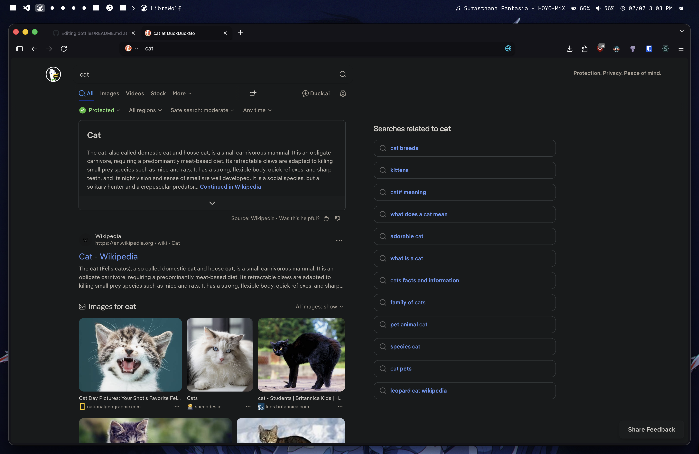

<h1 align="center">dotfiles</h1>

<p align="center">
    
    
    
</p>

## Quick start

Make sure you have `git`, `homebrew` and `bash >= 5.2` installed. Other things should be installed for you.

```bash
git clone https://github.com/matejstastny/dotfiles.git ~/dotfiles
cd ~/dotfiles
chmod +x ./bin/dot
./bin/dot all
```

## Usage

If you sourced my `.zprofile` the `dot` script should be in path, allowing you to call `dot` from anywhere. These are the default tasks, but you can add your own tasks by editing `./bin/dot`. There is an array of tasks on the very top of the scripts, its super easy to add your own. Just make sure you're using absolute paths!

```bash

dot [link|brew|assets|all]...

- link    - Symlinks configs
- brew    - Install & update Homebrew packages
- assets  - Install fonts and set wallpaper
- other   - Other random stuff
- all     - Run everything

```

### Link script

Most configs are linked as whole directories into `~/.config` Some configs are linked as files and/or into different locations. The script will ask if it finds a file to override it. If ran with `--force` it just does it. It's kinda cool I am proud of this script. Could i use `stow`? Yeah but this is more fun. If you want to just see what changed _would_ be made use the `--dry-run` flag. You can define exception on the top of the `./scripts/link.sh` script. Its very easy to add an exception. Heres the default ones:

```
- zsh    - contents linked as files into $HOME
- git    - contents linked as files into $HOME
- vscode - vscode user config directory, linked as files into `Application Support/VSCode`
```

### Homebrew script

This script updates `homebrew`, updates all installed packages and then installs packages from the `Brewfile` that are not installed, and uninstalls those that are not defined in the `Brewfile` but installed. I do this to keep my system clean without trash packages I needed once.

### Asset script

Installs the `Dank Mono Nerd Font` that I use for my mono font, the `Atkinson Hyperlegible Next` font that I use for `Obsidian` and sets wallpaper to [this](./assets/wallpapers/mac-wallpaper.jpg).
