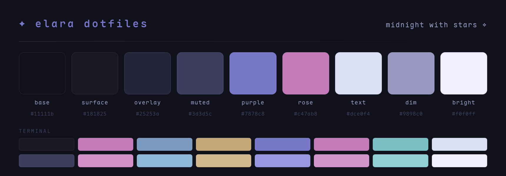

> Elara is a moon of Jupiter! Pallete above generated using a custom script :3

## Stacka

| Category          | Tool                                                                                          |
| ----------------- | --------------------------------------------------------------------------------------------- |
| **Distro**        | [Fedora Asahi Remix Minimal](https://asahilinux.org/fedora/)                                  |
| **Kernel**        | [fairydust](https://github.com/bharambetejas/asahi-fairydust-display)                         |
| **WM**            | [Hyprland](https://hyprland.org) (Lua)                                                        |
| **Bar**           | [Waybar](https://github.com/Alexays/Waybar)                                                   |
| **Launcher**      | [Rofi](https://github.com/davatorium/rofi)                                                    |
| **Notifications** | [SwayNC](https://github.com/ErikReider/SwayNotificationCenter)                                |
| **OSD**           | [SwayOSD](https://github.com/ErikReider/SwayOSD)                                              |
| **Wallpaper**     | [awww](https://codeberg.org/LGFae/awww) · [mpvpaper](https://github.com/GhostNaN/mpvpaper) (live) |
| **Terminal**      | [Kitty](https://sw.kovidgoyal.net/kitty/)                                                     |
| **Multiplexer**   | [Tmux](https://github.com/tmux/tmux)                                                          |
| **Shell**         | [Zsh](https://www.zsh.org) + [starship](https://starship.rs/)                                 |
| **Editor**        | [VSCodium](https://vscodium.com) · [Neovim](https://neovim.io)                                |
| **Fetch**         | [Fastfetch](https://github.com/fastfetch-cli/fastfetch)                                       |
| **Browser**       | [Helium](https://github.com/helium-browser/helium)                                            |
| **Discord**       | [Vesktop](https://github.com/Vencord/Vesktop)                                                 |
| **Notes**         | [Obsidian](https://obsidian.md)                                                               |

## Scripts

> Not all just core ones I am proud of

| Script              | Description                                                                                              |
| ------------------- | -------------------------------------------------------------------------------------------------------- |
| `link`              | Symlink configs                                                                                          |
| `cloud`             | onedrive syncer, wrapper of [rclone](https://rclone.org/)                                                |
| `remote`            | better ssh command with a hosts config file                                                              |
