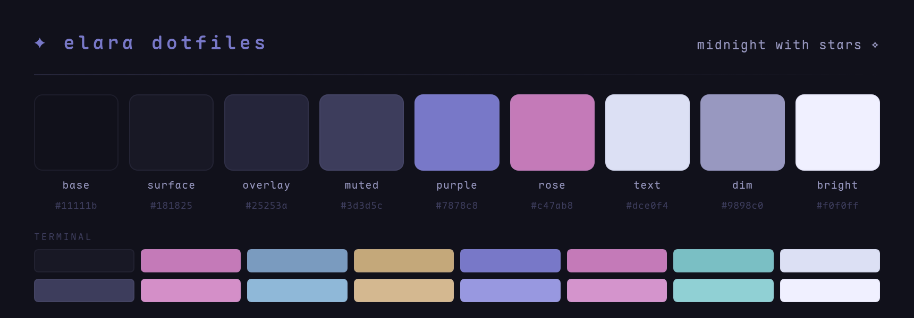

# elara

personal fedora asahi setup, the desktop shell it runs, and a little pi
fleet behind it.

## start here

- [`configs/quickshell`](configs/quickshell) is the qml desktop shell, about
  7,000 lines of the visible desktop.
- [`pi/services/io`](pi/services/io) holds the go + astro services on io:
  ytdl, quickshare, and a fleet dashboard.
- [`pi/services.md`](pi/services.md) is the short map of the three pis.
- [`configs`](configs) is everything linked into `~/.config`.
- [`scripts`](scripts) contains the desktop actions, while [`bin`](bin) is
  longer-lived command-line tooling.
- [`install`](install) is the machine setup, including the local quickshell
  build.

## using it

`bin/link --dry-run` shows the symlinks this repository would make.
`bin/link` makes only missing links, and leaves existing files alone.

```sh
just check
just fmt
```

`just check` parses the scripts, vets the go services, and typechecks each
astro app. it needs `just`, python, go, and pnpm. `just fmt` needs `shfmt`.

## stack

fedora asahi remix · hyprland · quickshell · zsh · kitty

the palette comes from `assets/palette.png`. elara is a moon of jupiter.
